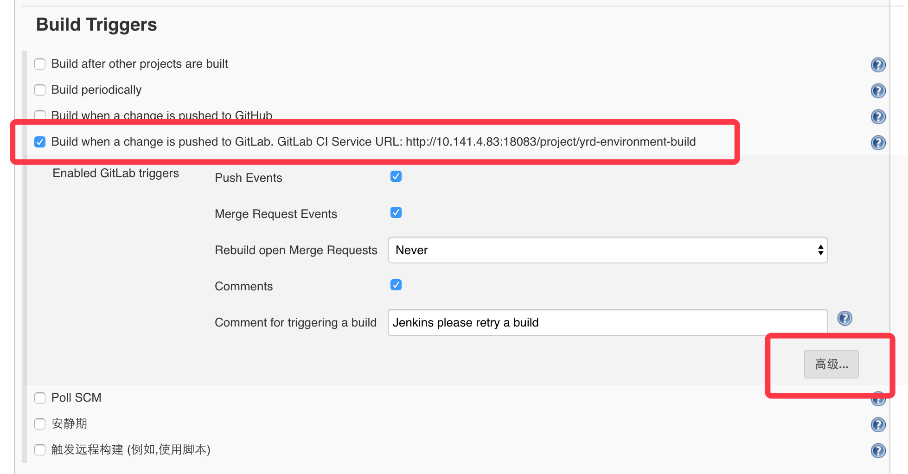
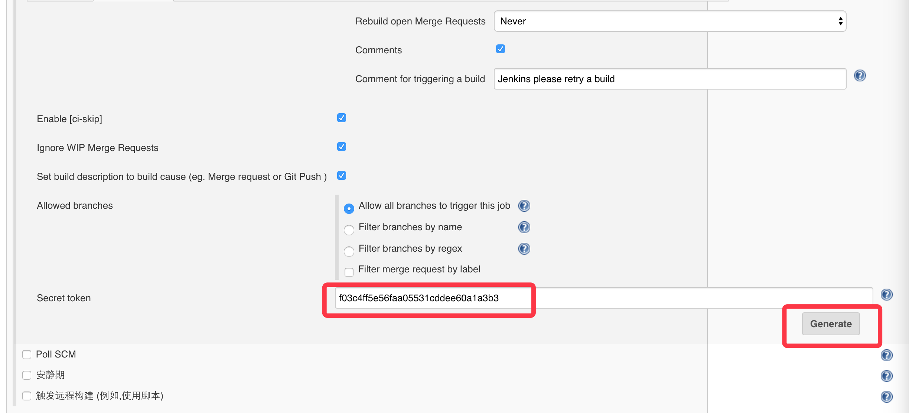
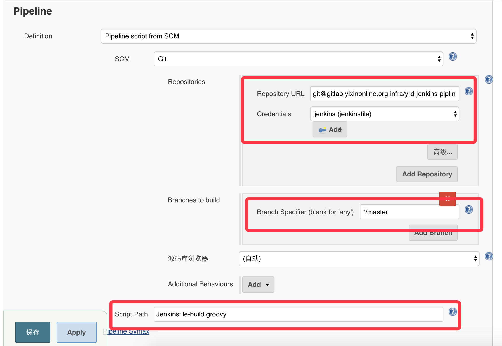
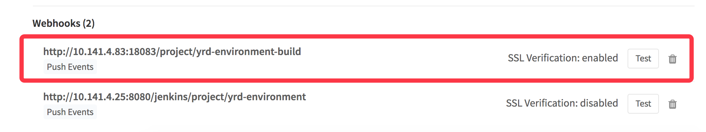
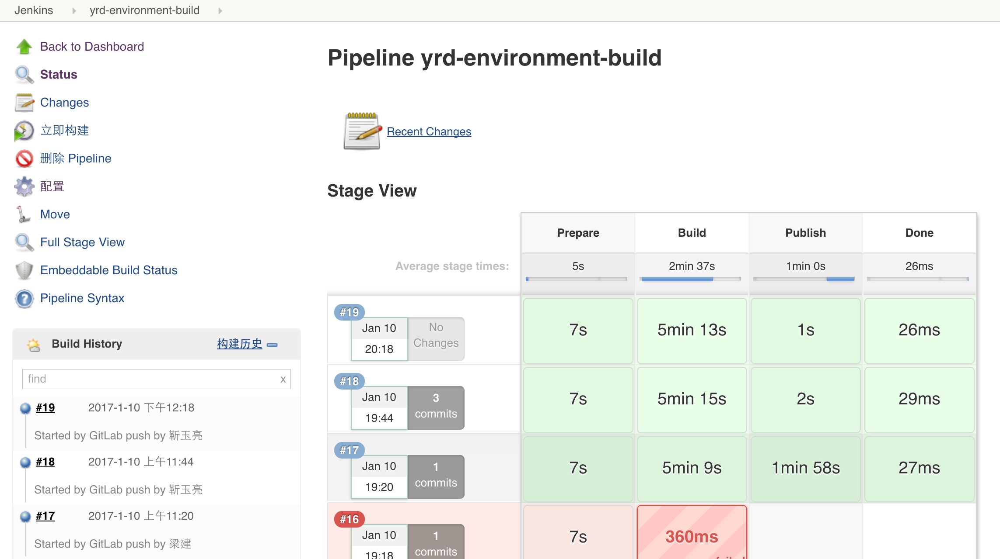
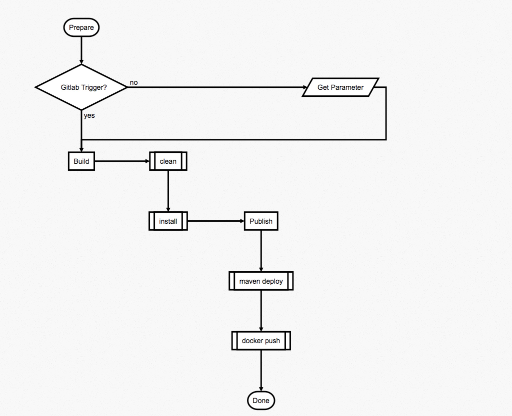
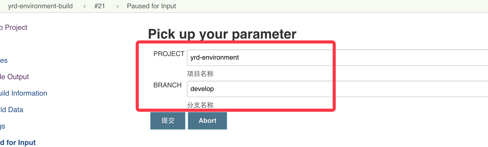
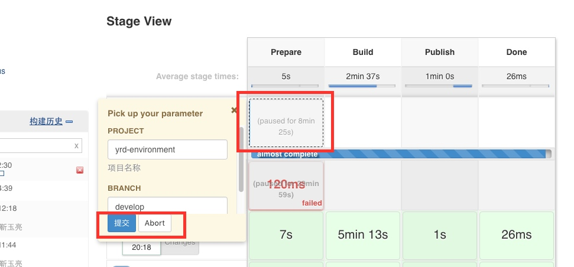
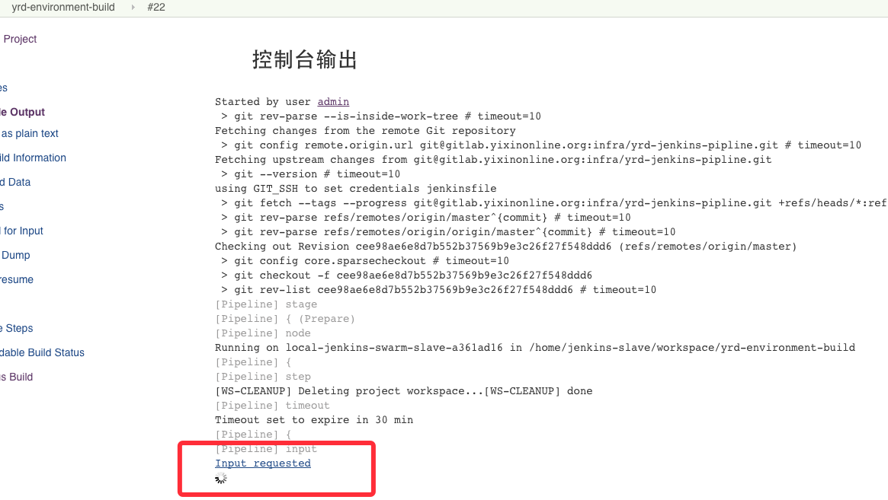
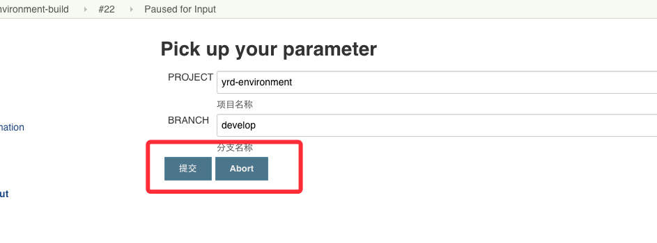

# BUILD_GUIDE

### 概述

构建过程，触发机制分为

- gitlab自动触发
- 一个是手工触发的参数化构建

在测试环境，由gitlab自动触发，配置了Push Event 和 Merge event的勾子，拉起Jenkins的构建任务。
构建任务会调用项目里的ci脚本来做项目的构建和发布，新的项目需要自己来提供ci脚本。
线上，由于环境隔离，线下的机器无法直接访问jenkins机器，所以gitlab的hook失效。
正式的上线流程里，需要在gitlab打出项目的tag版本，然后手工在jenkins的job上触发构建。

### 操作步骤
1. 在jenkins新建一个Pipeline风格的项目:
- http://jenkins.internal:18083/
- 'New' -> 'Pipeline' with name 'oss-jenkins-pipeline'

2. 如需配置项目在gitlab自动触发，需要在jenkins配置如下：

'Build Triggers'
- check 'Build when a change is pushed to GitLab. GitLab CI Service URL: http://jenkins.internal:18083/project/oss-jenkins-pipeline'
- 'Advanced' -> 'Generate' a 'Secret token'
 

3. 配置拉取构建脚本的Git路径,分支名以及脚本目录。
'Pipeline' 
- 'Definition'
> Select 'Pipeline script from SCM'
- 'SCM'
> Select 'Git'
- 'Repositories'
  + 'Repository UR'
  > Input 'ssh://git@gitlab.internal:20022/home1-oss/oss-jenkins-pipeline.git'
  + 'Branches to build'
  > Input '*/master'
  + Find SSH key
    - `docker exec gitlab.internal /app/gitlab/entrypoint.sh export_git_admin_key`
  + 'Credentials' -> 'Add'
     > 'Domain' select 'Global credentials (unrestricted)'
     > 'Kind' select 'SSH Username with private key'
     > 'Scope' select 'Global'
     > 'Username' input 'git'
     > 'Private Key' -> 'Enter directly'
     > 'ID' -> 'jenkinsfile'
- 'Script Path'
> Input 'src/main/pipeline/Jenkinsfile_deploy.groovy'

4. 如需gitlab触发jenkins的构建，需要在gitlab上的项目添加webhook：

5. 配置完成

### 流程说明
上面的示例，核心的部署逻辑都被隐藏在了Jenkinsfile-build.groovy的pipeline脚本中，下面简单介绍下构建的核心步骤：

流程图如下

1.Prepare阶段主要完成如下几件事：  
> 生成构建参数->拉取部署jenkins项目->拉取待构建项目
> 参数有两个来源，如果配置了gitlab的webhoot，则会自动将待构建项目的信息带入，否则需要用户在构建过程输入待构建项目的信息：

2.Build的过程包括： 

> 设置环境变量->执行mvn构建并将产物deploy到本地

3.Publish的过程包括:  
> mvn deploy->docker push

4.Done

# DEPLOY_GUIDE

### 概述
> 目前，OSS的服务，使用docker进行部署，这里使用Pipeline实现了docker镜像的自动部署过程。
主要特性包括：

- 支持并行部署多个节点，
- 支持分批次部署，可先部署少量节点，验证通过后再行部署其他节点
- 部署失败支持回滚操作，需要手工触发部署上一版本

### 操作步骤
1. 在jenkins新建一个Pipeline风格的项目:
2. 这里配置了Build Triggers，在oss service build任务执行完毕后触发

3. 配置获取部署脚本的Git路径,分支名以及脚本文件。(注意k8s部署的配置文件为 jenkinsfile_deploy_mixed.groovy. 当gitlab的ssh端口是非22(如20022)的情况下，项目url要写成 ssh://git@gitlab.internal:20022/home1-oss/oss-jenkins-pipeline.git)

注意：这里Credentials如果没有配置过，需要添加一个私钥，用来访问gitlab的项目:

4. 配置完成

### 流程说明
这里上面的部署流程如下：

PreDeploy是预发布环节，默认会部署一台，然后等待确认服务OK后再行部署其他节点：

流程图如下：

### NOTES
+ 用Snippet Generator生成的pipeline下拉列表语法报错，需要使用`[$class: 'ChoiceParameterDefinition', choices: 'staging\nproduction', description: '环境', name:'ENV']`替换生成的下拉选择代码。
+ groovy脚本运行在一个沙箱中，有些方法默认没有权限执行，需要在jenkins的配置中做额外配置

+ 不熟悉脚本语言的用户注意，groovy脚本中''不能引用变量，“”才可以引用变量，如"${env}"

### Notes
目前构建脚本支持两种方式触发
- gitlab的hook触发，参数自动带入，但需要预先配置
- 手工触发，手工触发需要注意，点击立即构建后，需要再次点击构建流程，到达定制参数的页面，如下：
    从stage view进入

    从日志页面进入：
    

