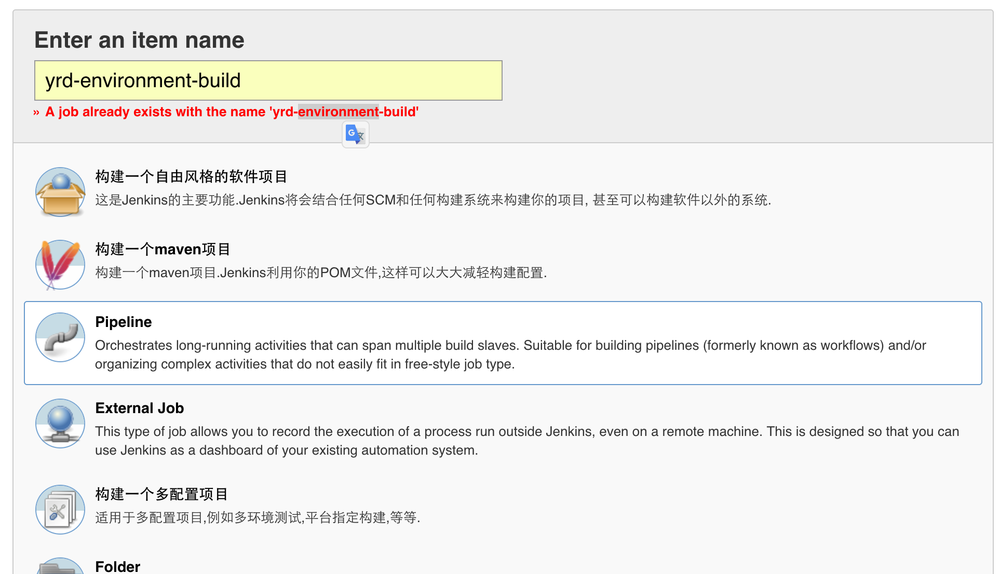
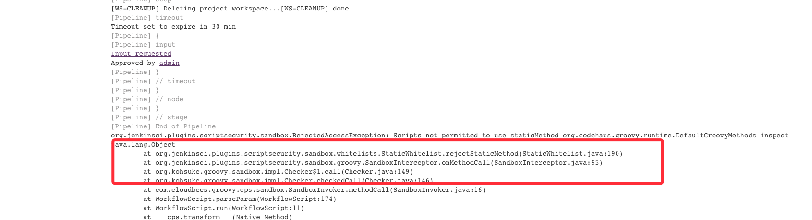
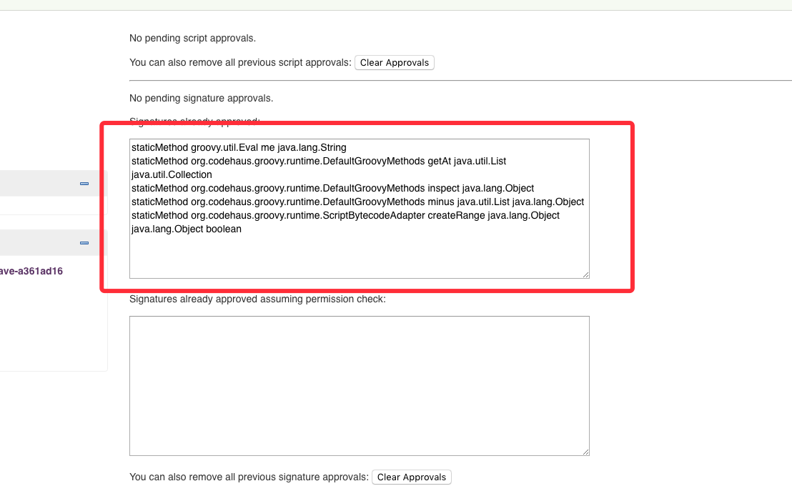

# BUILD_GUIDE

### 概述
> 构建过程，触发机制分为两种，一个是gitlab自动触发，一个是手工触发的参数化构建；在测试环境，由gitlab自动触发，配置了Push Event 和 Merge event的勾子，拉起Jenkins的构建任务。构建任务会调用项目里的ci脚本来做项目的构建和发布，新的项目需要自己来提供ci脚本。线上，由于环境隔离，线下的机器无法直接访问jenkins机器，所以gitlab的hook失效。正式的上线流程里，需要在gitlab打出项目的tag版本，然后手工在jenkins的job上触发构建。

### 操作步骤
1. 在jenkins新建一个Pipeline风格的项目:

2. 如需配置项目在gitlab自动触发，需要在jenkins配置如下：

3. 配置拉取构建脚本的Git路径,分支名以及脚本目录。

注意：这里Credentials如果没有配置过，需要添加一个私钥，用来访问gitlab的项目:

4. 如需gitlab触发jenkins的构建，需要在gitlab上的项目添加webhook：

5. 配置完成

### 流程说明
上面的示例，核心的部署逻辑都被隐藏在了Jenkinsfile-build.groovy的pipeline脚本中，下面简单介绍下构建的核心步骤：

流程图如下

1.Prepare阶段主要完成如下几件事：  
> 生成构建参数->拉取部署jenkins项目->拉取待构建项目
> 参数有两个来源，如果配置了gitlab的webhoot，则会自动将待构建项目的信息带入，否则需要用户在构建过程输入待构建项目的信息：

2.Build的过程包括： 

> 设置环境变量->执行mvn构建并将产物deploy到本地

3.Publish的过程包括:  
> mvn deploy->docker push

4.Done

### gitlab插件环境变量
> 在pipeline的构建脚本中，如果是gitlab的webhook触发，可以获取如下的构建参数：

propertyName|value|description|
---|---|---
gitlabBranch | master | 分支
gitlabSourceBranch | master| 
gitlabActionType | PUSH| 触发事件
gitlabUserName | 梁建| 用户名
gitlabUserEmail | jianliang9@yirendai.com| 用户邮箱
gitlabSourceRepoHomepage | http://gitlab.internal/jianliang9/my-pipeline-test|http地址
gitlabSourceRepoName | my-pipeline-test|项目名
gitlabSourceNamespace | jianliang9|
gitlabSourceRepoURL | git@gitlab.internal:jianliang9/my-pipeline-test.git|
gitlabSourceRepoSshUrl | git@gitlab.internal:jianliang9/my-pipeline-test.git|
gitlabSourceRepoHttpUrl | http://gitlab.internal/jianliang9/my-pipeline-test.git|
gitlabMergeRequestTitle | null|
gitlabMergeRequestDescription | null|
gitlabMergeRequestId | null|
gitlabMergeRequestIid | null|
gitlabMergeRequestLastCommit | 2c4467453d9814f67cf82faba32c9320544fe1c5|
gitlabTargetBranch | master|
gitlabTargetRepoName | null|
gitlabTargetNamespace | null|
gitlabTargetRepoSshUrl | null|
gitlabTargetRepoHttpUrl | null|
gitlabBefore | 9361e4aab88cb85d326ff8bbd9b97f0383010133|
gitlabAfter | 2c4467453d9814f67cf82faba32c9320544fe1c5|
gitlabTriggerPhrase | null|

### Notes
- Jenkins的Slave节点采用Docker镜像得方式启动的的话，需要挂载如下volume: `-v /var/run/docker.sock:/var/run/docker.sock`然后在宿主机给sock文件增加777的权限 `chmod 777 /var/run/docker.sock`
- 目前构建脚本支持两种方式触发，一种是gitlab的hook触发，参数自动带入，但需要预先配置；另一种是手工触发，手工触发需要注意，点击立即构建后，需要再次点击构建流程，到达定制参数的页面，如下：
    从stage view进入

    从日志页面进入：
    

- 首次构建，可能会遇到groovy脚本执行权限受阻的情形，形如：

需要进入系统管理->In-process Script Approval将对应的方法加入白名单

- 其他

