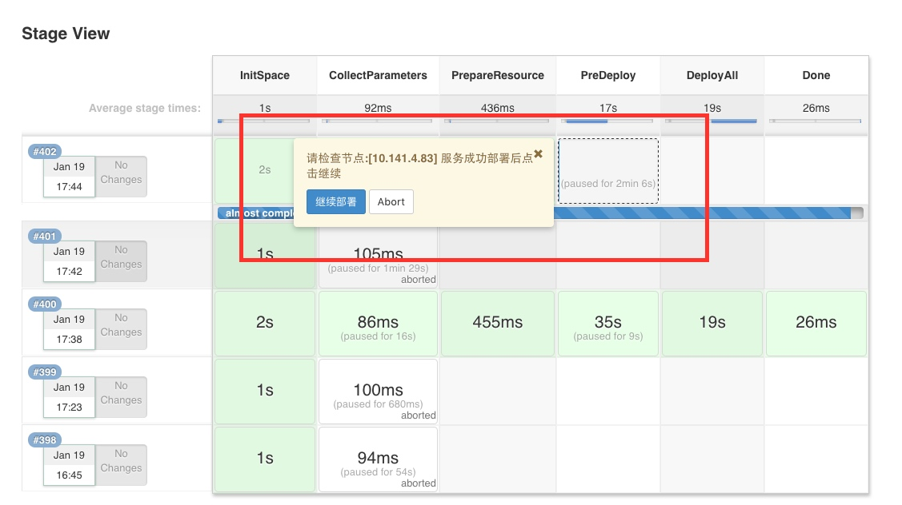
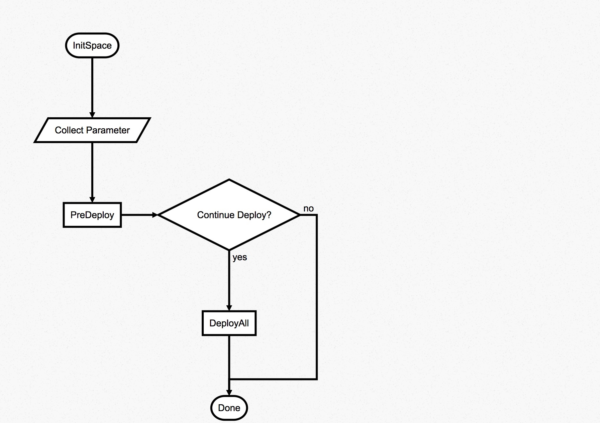

# BUILD DEPLOY GUIDE

### 概述
> 目前，OSS的服务，使用docker进行部署，这里使用Pipeline实现了docker镜像的自动部署过程。
主要特性包括：

- 支持并行部署多个节点，
- 支持分批次部署，可先部署少量节点，验证通过后再行部署其他节点
- 部署失败支持回滚操作，需要手工触发部署上一版本

目前脚本支持两种方式触发
- gitlab的hook触发，参数自动带入，需要预先配置
- 手工触发的参数化构建，手工触发需要注意，点击立即构建后，需要再次点击构建流程，到达定制参数的页面，如下：
  从stage view进入
  
  从日志页面进入：
  
  

在测试环境，由gitlab自动触发，配置了Push Event 和 Merge event的勾子，拉起Jenkins的构建任务。
构建任务会调用项目里的ci脚本来做项目的构建和发布，新的项目需要自己来提供ci脚本。
线上，由于环境隔离，线下的机器无法直接访问jenkins机器，所以gitlab的hook失效。
正式的上线流程里，需要在gitlab打出项目的tag版本，然后手工在jenkins的job上触发构建。

### 操作步骤
1. 在jenkins新建一个Pipeline风格的项目:
- http://jenkins.internal:18083/
- 'New' -> 'Pipeline' with name 'oss-jenkins-pipeline'

2. Triggers

- 如需配置由gitlab触发构建
  'Build Triggers'
  - check 'Build when a change is pushed to GitLab. GitLab CI Service URL: http://jenkins.internal:18083/project/oss-jenkins-pipeline'
  - 'Advanced' -> 'Generate' a 'Secret token'
    
    

- 如需配置在构建后自动部署
  'Build Triggers'
  - check 'Build after other projects are built'
  - 'Projects to watch' input comma split project names
  - check 'Trigger only if build is stable'

3. 配置拉取构建脚本的Git路径,分支名以及脚本目录

'Pipeline' 
- 'Definition'
> Select 'Pipeline script from SCM'

- 'SCM'
> Select 'Git'
  - 'Repositories'
    + 'Repository UR'
    > Input 'ssh://git@gitlab.internal:20022/home1-oss/oss-jenkins-pipeline.git'
    + 'Branches to build'
    > Input '*/master'
    + Find SSH key
      - `docker exec gitlab.internal /app/gitlab/entrypoint.sh export_git_admin_key`
    + 'Credentials' -> 'Add'
    > 'Domain' select 'Global credentials (unrestricted)'
    > 'Kind' select 'SSH Username with private key'
    > 'Scope' select 'Global'
    > 'Username' input 'git'
    > 'Private Key' -> 'Enter directly'
    > 'ID' -> 'jenkinsfile'

- 'Script Path'
> Input 'src/main/pipeline/Jenkinsfile_deploy.groovy'

(注意k8s部署的配置文件为 jenkinsfile_deploy_mixed.groovy)

4. 如需gitlab触发jenkins的构建，需要在gitlab上的项目添加webhook：

5. 配置完成

### BUILD流程说明
上面的示例，核心的部署逻辑都被隐藏在了Jenkinsfile-build.groovy的pipeline脚本中，下面简单介绍下构建的核心步骤：

流程图如下

1.Prepare阶段主要完成如下几件事：  
> 生成构建参数->拉取部署jenkins项目->拉取待构建项目
> 参数有两个来源，如果配置了gitlab的webhoot，则会自动将待构建项目的信息带入，否则需要用户在构建过程输入待构建项目的信息

2.Build的过程包括
> 设置环境变量->执行mvn构建并将产物deploy到本地

3.Publish的过程包括:  
> mvn deploy->docker push

4.Done

### DEPLOY流程说明
这里上面的部署流程如下：

PreDeploy是预发布环节，默认会部署一台，然后等待确认服务OK后再行部署其他节点：

流程图如下：

