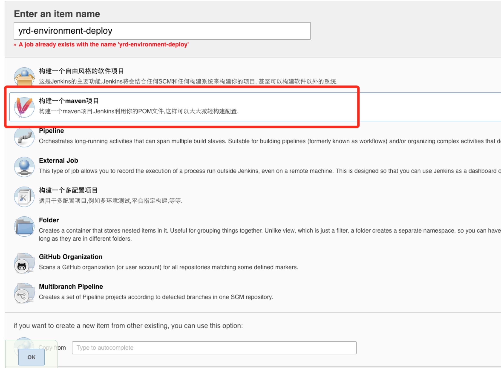
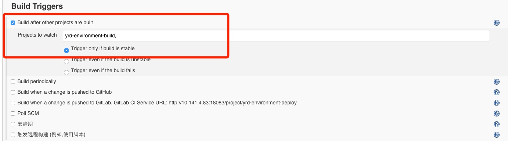
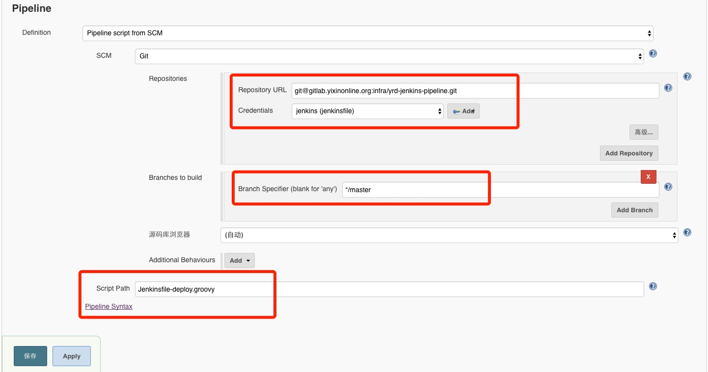
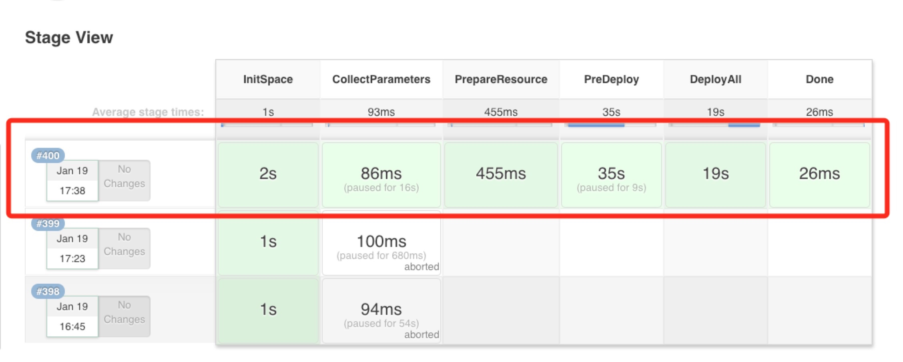
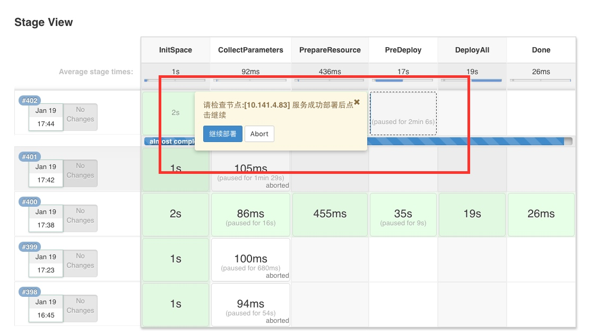
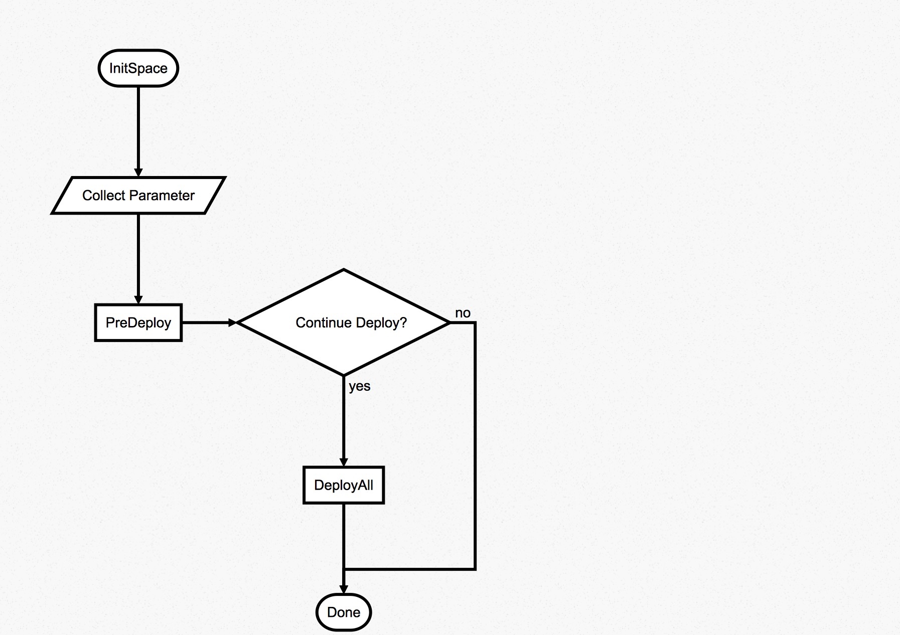
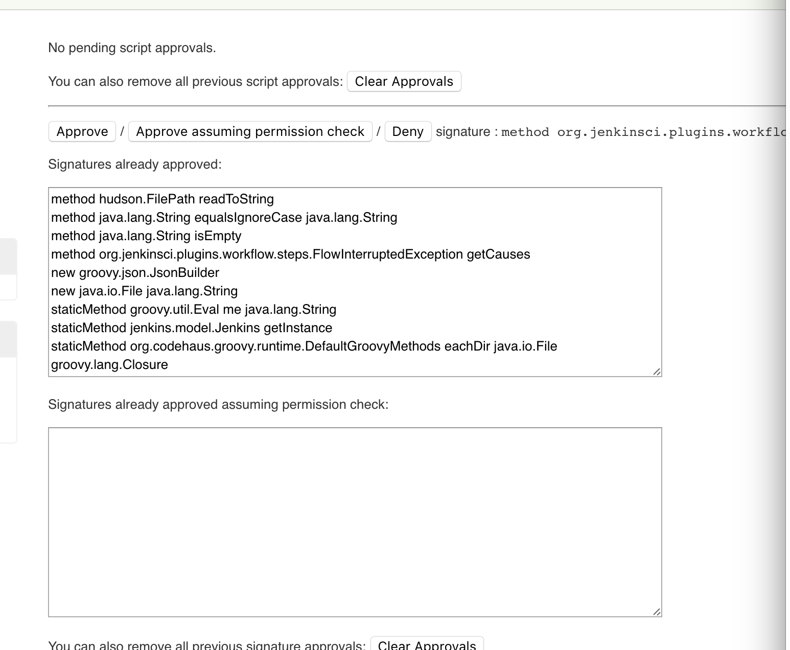

# DEPLOY_GUIDE

### 概述
> 目前，OSS的服务，使用docker进行部署，这里使用Pipeline实现了docker镜像的自动部署过程。
主要特性包括：

- 支持并行部署多个节点，
- 支持分批次部署，可先部署少量节点，验证通过后再行部署其他节点
- 部署失败支持回滚操作，需要手工触发部署上一版本

### 操作步骤
1. 在jenkins新建一个Pipeline风格的项目:

2. 这里配置了Build Triggers，在oss service build任务执行完毕后触发

3. 配置获取部署脚本的Git路径,分支名以及脚本文件。(注意k8s部署的配置文件为 jenkinsfile_deploy_mixed.groovy. 当gitlab的ssh端口是非22(如20022)的情况下，项目url要写成 ssh://git@gitlab.internal:20022/home1-oss/oss-jenkins-pipeline.git)

注意：这里Credentials如果没有配置过，需要添加一个私钥，用来访问gitlab的项目:

4. 配置完成

### 流程说明
这里上面的部署流程如下：

PreDeploy是预发布环节，默认会部署一台，然后等待确认服务OK后再行部署其他节点：

流程图如下：

### NOTES
+ 用Snippet Generator生成的pipeline下拉列表语法报错，需要使用`[$class: 'ChoiceParameterDefinition', choices: 'staging\nproduction', description: '环境', name:'ENV']`替换生成的下拉选择代码。
+ groovy脚本运行在一个沙箱中，有些方法默认没有权限执行，需要在jenkins的配置中做额外配置

+ 不熟悉脚本语言的用户注意，groovy脚本中''不能引用变量，“”才可以引用变量，如"${env}"
